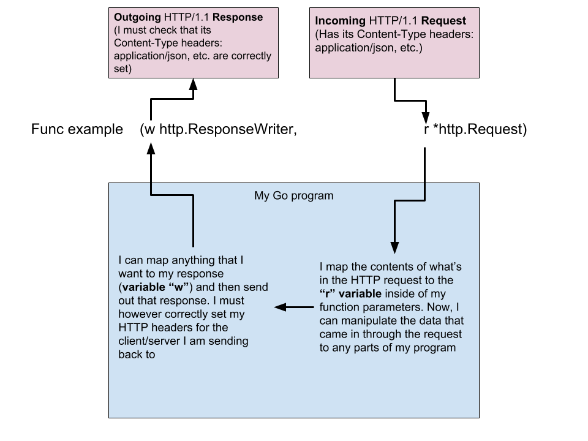

# golang-practice

The purpose of this repository is to refamiliarize myself with Golang, practice new concepts, and create foundations for my Golang education.

**Basic REST concepts:
REST uses only four basic commands for its protocol over HTTP:**

- `GET`: Clients can request the status of a resource by making an HTTP GET request to the server, using the resource's URI (Uinque Resource Identifier). REST requires that thsi operation does not produce any side effect to the resource's status (nullipotent)
- `PUT`: Creates a new resource. Since the client does not know the next invoice number, the URI can be: http://www.mysite.com/invoice/841 (for example) is (and must be) idempotent. Invoice 841 must not be created multiple times if clients call that PUT requests several times.
- `POST`: POST requires POST client requests to update the corresponding resource with information provided by the client, or to create this resource if it does not exist. This operation is not idempotent.
- `DELETE`: This operation removes the resource forever. It is idempotent.

The format (JSON, XML, ...) used to return representations of resources is set in the media type of the server..

To handle success or errors issues, HTTP REST recommends using one of the HTTP status Codes. https://en.m.wikipedia.org/wiki/List_of_HTTP_status_codes

**Everything finally fucking clicked today with this project, as I annotated this block of code:**

```go
//Create a new book function
func createBook(w http.ResponseWriter, r *http.Request) {
	//formats the HTTP headers we will send back when we write our response
	w.Header().Set("Content-Type", "application/json")
	//new variable, of the custom type Book that we made (the struct above)
	var book Book
	//takes the request sent to us (in json) and Decodes it into our &book variable we declared
	_ = json.NewDecoder(r.Body).Decode(&book)
	//randomly generates an id for our book up to the number 100000000, then applies to the "ID" of our book variable (mock id - not safe)
	book.ID = strconv.Itoa(rand.Intn(100000000))
	//takes all the data we've randomly generated and Decoded from the JSON request sent, and appends it into our []books array of Book type objects
	books = append(books, book)
	//Writes a response (variable "w") to the requester with a JSON encoding of the book variable we created through this process
	json.NewEncoder(w).Encode(book)
}
```

In the function `createBook()` I am passing in two **optional** parameters. An http request from an outside source (`r *http.Request`, making `r` my variable for the `*http.Request` variable type), and then choosing to respond back to the requester (optional) using the `w http.ResponseWriter` (`w` being the variable for the `http.ResponseWriter` variable type).

# HTTP protocol
HTTP sends shit via codes... **I need to memorize these codes**, but here are the most commonly referred to/used:
- `200` OK
- `400` Bad Request
- `401` Unauthorized
- `403` Forbidden
- `404` Not Found
- `500` Internal Server Error
- `503` Service Unavailable
- `550` Permission Denied

They most commonly send using protocol version 1.1, or:

`HTTP/1.1 200 ok` (HTTP protocol version 1.1, the request went ok)

This information also exists in the `headers` of the HTTP requests and responses, something very important to know. The headers will prepare the response/request of my Go program for the type of information that it might receive. Hence:

```go
    w.Header().Set("Content-Type", "application/json")
```

in the above code. It will be up to the requester to send their correct `HTTP Headers` if they want to interact with my program, and it's also up to me to specify what headers I will need. REST API's for `json` will essentially always be `application/json`. In my case, I am setting the `Content-Type` Header to `application/json` so that when I send back my response, that server will know I am sending content in my response meant to be read as `json`



# bbolt

On the 1st of October, I did not get as far with the understanding of the database as I would have liked. I will return to it.